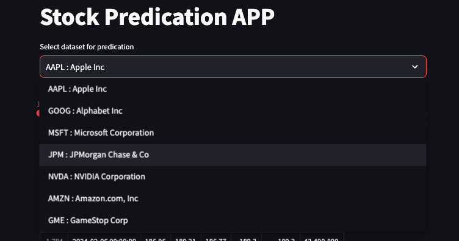
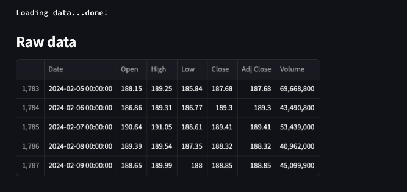
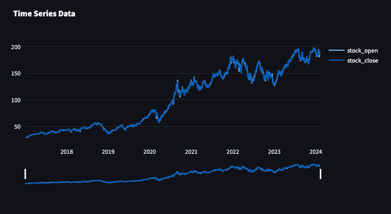
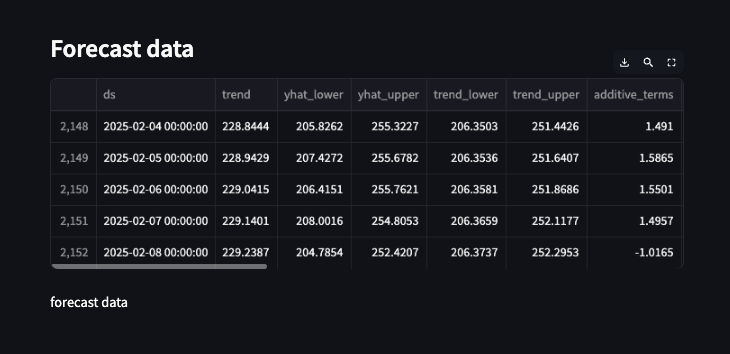
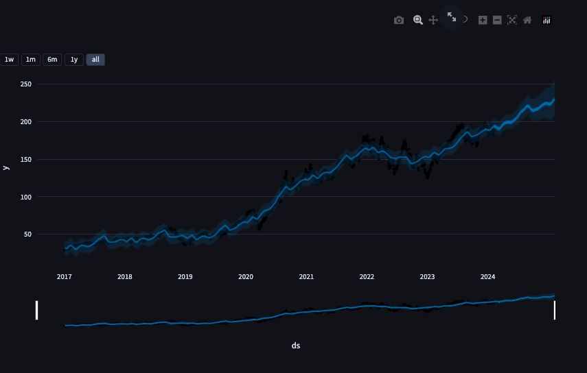
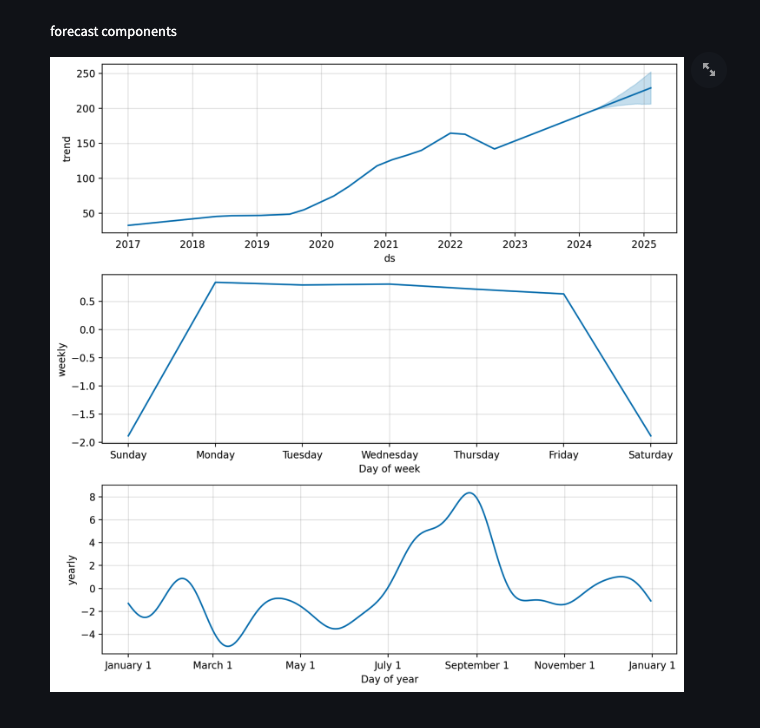

## Overview
This project goal to is to setup api connection with Yahoo Finanice and download stock data based on passed parameters of stock selection ex. {"AAPL : Apple Inc","GOOG : Alphabet Inc","MSFT : Microsoft Corporation","JPM : JPMorgan Chase & Co"} and make prediction base on historical data using Facebook's Prophet

## Setup virtual environment 

```
Create Virtual environment
python3 -m venv <myenvname>

Activate Virtual environment
source /path/to/virtualenvname/activate

```

## install require packages
```
pip install streamlit fbprophet yfinance plotly

```
```
import streamlit as st
from datetime import date

import yfinance as yf
from prophet import Prophet
from prophet.plot import plot_plotly
from plotly import graph_objs as go
```



## Create list of stock to select
```
stocks = ("AAPL : Apple Inc","GOOG : Alphabet Inc","MSFT : Microsoft Corporation","JPM : JPMorgan Chase & Co","NVDA : NVIDIA Corporation","AMZN : Amazon.com, Inc","GME : GameStop Corp")
selected_stocks = st.selectbox("Select dataset for predication", stocks)
selected_stocks = selected_stocks[0:selected_stocks.index(" ")]

```

## specify the number of days to predict stock [1 to 4 years] 
```
n_years = st.slider("Years of predication:", 1, 4)
period = n_years * 365 

```

## Connect to the Yahoo Finance api load data
```
@st.cache_data
def load_data(ticker):
    data = yf.download(ticker, START, TODAY)
    data.reset_index(inplace=True)
    return data
data_load_state = st.text("Load data...")
data = load_data(selected_stocks)
data_load_state.text("Loading data...done!")

```


## Select only the important features i.e. the date and price Plot current state stock
```
def plot_raw_data():
    fig = go.Figure()
    fig.add_trace(go.Scatter(x=data['Date'], y=data['Open'], name='stock_open'))
    fig.add_trace(go.Scatter(x=data['Date'], y=data['Close'], name='stock_close'))
    fig.layout.update(title_text="Time Series Data", xaxis_rangeslider_visible=True)
    st.plotly_chart(fig)
plot_raw_data()

```



## Fit the model using all data and specify the number of Years to predict using Prophet
```
# Fotecasting
df_train = data[['Date','Close']]
df_train = df_train.rename(columns={"Date": "ds", "Close": "y"})

m = Prophet()
m.fit(df_train)
future = m.make_future_dataframe(periods=period)
forecast = m.predict(future)

```


## Plot forecast data 
```
st.subheader('Forecast data')
st.write(forecast.tail())

st.write('forecast data')
plot_plotly(m,forecast)
fig1 = plot_plotly(m, forecast)
st.plotly_chart(fig1)

st.write('forecast components')
fig2 = m.plot_components(forecast)
st.write(fig2)

```


